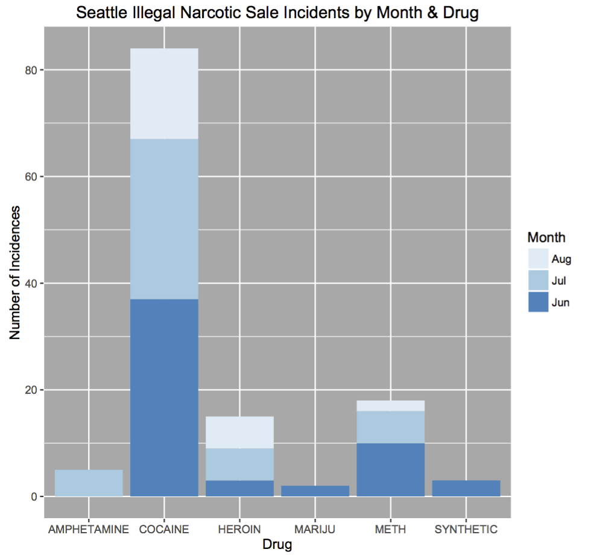
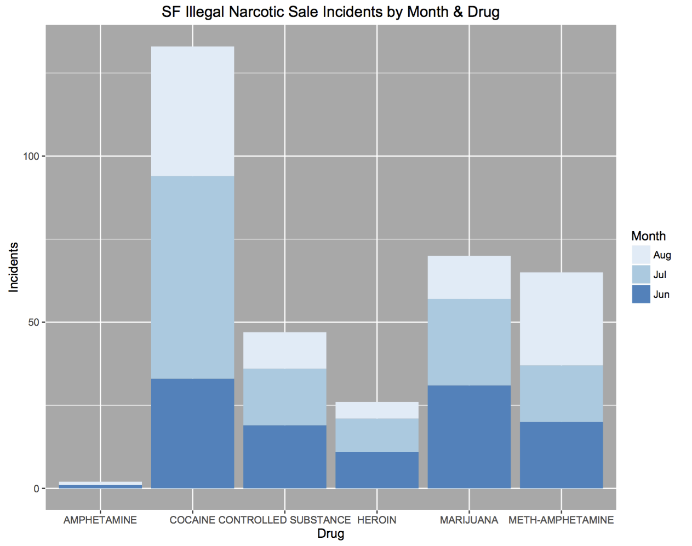

# Drug Crimes in Seattle and San Francisco

An interesting comparison of drug crime patterns between two major cities, Seattle  and San Francisco.

## Method and Assumptions
Data were drawn from crime data of the two cities covering the summer months of June, July and August of 2014. 
We selected crimes classified as 'narcotics'. We then further selected crimes related to the 'sale' of narcotics.
We then performed a summary analysis of the select data by month (time) and type of drug.

Analysis is repeatable with the R code available in the repository.

### Assumptions
We assume the sale of a drug is proportional to its demand.
Subsequently, we also assume that detection and enforcement are uniform across the time period; reasonable considering the time period is over the summer.

## Results 

